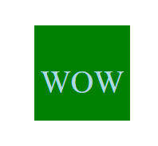

# Module-10-Challenge-Logo-Creator
Creating a logo in a .svg file using the command line. 

## Description:
    This app uses node.js to dynamically generate a logo from a .svg file. It takes 4 user prompts: characters for the text, text color, shape (3 options), and shape color. Then it imports the users answers into the template which in turn can be opened in a browers to display the logo generated from the answers to the prompts. 

## Table of Contents:
* [Installation](#installation)
* [Usage](#usage)
* [Credits](#credits)
* [License](#license)

## Installation
    You need to stall jest in the dev dependencies to test the shape classes. Validate-color is installed to validate that the user is providing a proper color name or #hexidecimal value. Inquirer is also needed for the node prompts.  

## Usage
    First navigate to the directory using the command line then type npm run test to make sure the code for the shapes are working. Then navigate to the utils folder and run node index.js to answer the prompts. The logo.svg will be generated and can be opened to view the file. Right click and open with live server to see the logo. 

## Credits
    

## License  

## Tests
Jest was used for testing the code for generating the shapes. 

## Questions

  

  Link to video showing userablilty. 
 https://watch.screencastify.com/v/fTwL0Qsxapjmb5RHW0MP
 
 
 
 
 